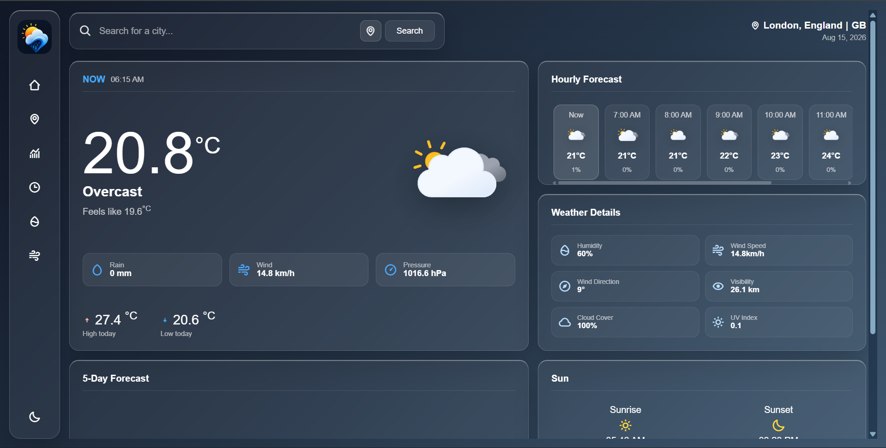
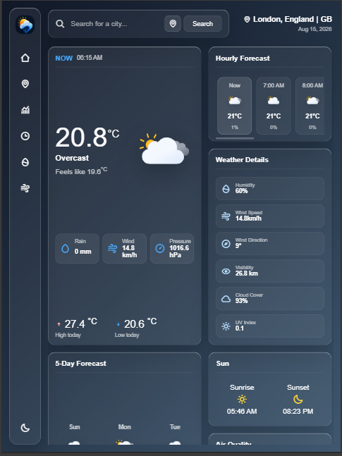
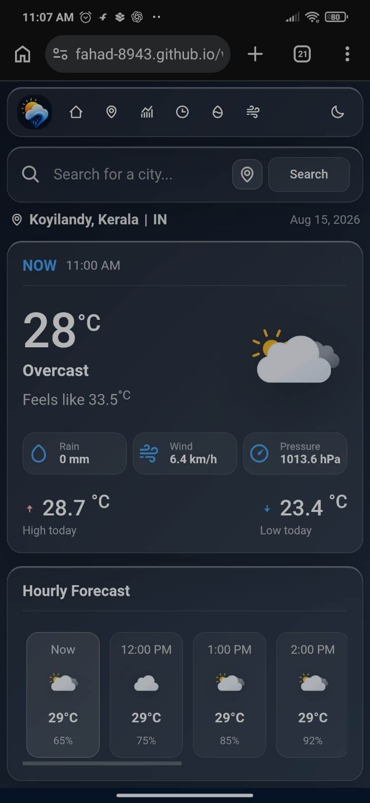

# 🌦️ Weather App

A responsive weather dashboard built with HTML, CSS, and JavaScript that provides real-time weather information using the Open-Meteo APIs.

The application allows users to search for cities, use their current location, view hourly and 5-day forecasts, check detailed weather conditions, and view air-quality information.

## 🚀 Live Demo

https://fahad-8943.github.io/weather-app/

## 📂 GitHub Repository

https://github.com/Fahad-8943/weather-app

---

## ✨ Features

- 🔍 Search weather by city name
- 📍 Detect weather using the user's current location
- 🌡️ Display current temperature and feels-like temperature
- 🌧️ Show rainfall, wind speed, and atmospheric pressure
- 🕐 Hourly weather forecast
- 📅 5-day weather forecast
- 💧 Humidity information
- 🌬️ Wind speed and direction
- 👁️ Visibility information
- ☁️ Cloud coverage
- ☀️ UV index
- 🌅 Sunrise and sunset times
- 🌫️ Air Quality Index (AQI)
- 🧪 PM2.5 and PM10 information
- 🌤️ Dynamic weather icons
- 🌦️ Weather-based background themes
- 🌙 Light/Dark theme toggle
- 📱 Responsive design for different screen sizes
- ⏳ Loading skeletons while weather data is being fetched

---

## 🛠️ Technologies Used

### Frontend

- HTML5
- CSS3
- JavaScript (ES6+)

### APIs

- Open-Meteo Weather API
- Open-Meteo Geocoding API
- Open-Meteo Air Quality API
- BigDataCloud Reverse Geocoding API

### Libraries / Resources

- Boxicons
- SVG weather icons

---

## 🔌 API Integration

The application retrieves weather information from the Open-Meteo API.

The weather request includes current, hourly, and daily weather data such as:

- Temperature
- Apparent temperature
- Humidity
- Rain
- Wind speed
- Wind direction
- Atmospheric pressure
- Visibility
- Cloud cover
- Weather codes
- Sunrise and sunset
- Precipitation probability

The application also retrieves air-quality information including:

- European AQI
- PM2.5
- PM10
- UV Index

---

## 📍 Location Detection

Users can search for a city manually or allow the application to access their current location through the browser's Geolocation API.

When GPS coordinates are available, reverse geocoding is used to determine the user's city and region before retrieving the weather information.

---

## 🎨 Dynamic Weather Interface

The interface changes according to the current weather condition and whether it is day or night.

Weather codes are mapped to conditions such as:

- Clear sky
- Partly cloudy
- Overcast
- Fog
- Drizzle
- Rain
- Snow
- Thunderstorm

The application then selects an appropriate weather icon and background theme.

---

## 📱 Responsive Design

The dashboard is designed to work across desktop and mobile screen sizes.

The desktop layout uses CSS Grid, while the mobile layout switches to a single-column structure with responsive navigation and forecast sections.

---

## 🧠 What I Practiced

This project helped me practice:

- Working with REST APIs
- Using `fetch()` for asynchronous requests
- Working with `async/await`
- Processing JSON API responses
- DOM manipulation
- Dynamic HTML rendering
- Browser Geolocation API
- Reverse geocoding
- Event listeners
- Array methods and data processing
- Conditional rendering
- Responsive CSS
- CSS Grid and Flexbox
- Loading states
- Error handling
- Building a responsive user interface

---

## 📸 Screenshots

Add screenshots of the application here.

### Desktop



### Tablet



### Mobile



---

## 📁 Project Structure

```text
weather-app/
│
├── assets/
│   ├── icons/
│   ├── logo.png
│   └── screenshots/
│
├── index.html
├── style.css
├── script.js
└── README.md


```
